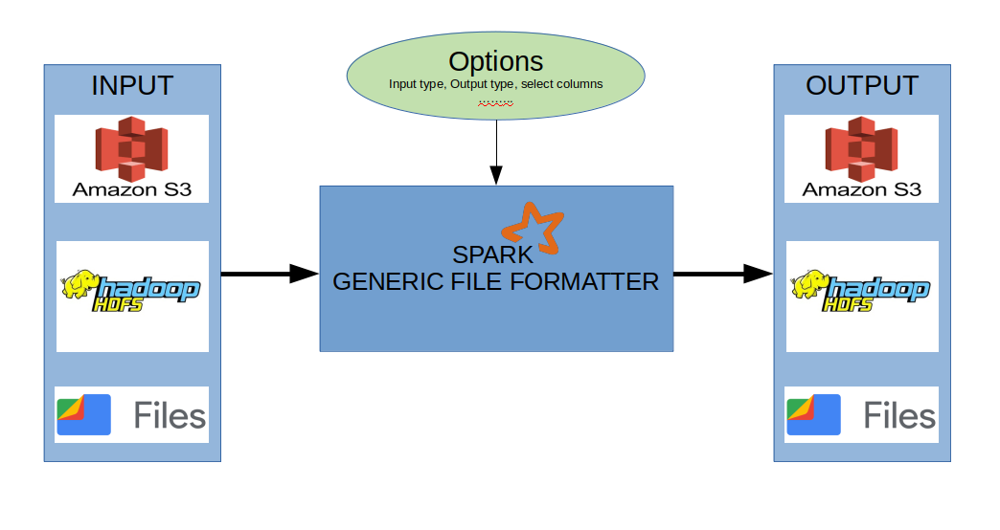

# spark_generic_file_formatter
### INTRODUCTION
This is a simple spark utility which is used to convert any file format (JSON, CSV, TXT, SEQ, PARQUET, ORC, AVRO) to any file format (JSON, CSV, TXT, SEQ, PARQUET, ORC, AVRO). 
##### it supports :
1. exclusion of columns in the Output (Supports Nested fields in Structures, Maps, Arrays, Array of Structs and Array of Maps).
2. selection of specific columns
3. Query based selection
4. Controling output partitions
5. various types of compressions (Snappy, Gzip, Deflate, ..)

### BASIC ARCHITECTURE

### HOW TO USE
STEP 1 : Clone the repo
STEP 2 : Build the JAR using maven package or open the project in the intellij and do the maven package from the maven life cycle.
STEP 3 : Run the JAR

    Command Line Arguments
    --APP_NAME (required)               : NAME OF THE SPARK APPLICATION
    --INPUT_SCHEMA (optional)           : STATIC SCHEMA PATH
    --INPUT_PATH (required)             : INPUT PATH
    --SELECT_COLUMN_FILE (optional)     : SELECTED OUTPUT COLUMN FILE (SAMPLE IS PROVIDED IN THE RESOURCES FOLDER)
    --SELECT_QUERY_FILE (optional)      : SELECTED OUTPUT COLUMN FILE (SAMPLE IS PROVIDED IN THE RESOURCES FOLDER)
    --OMIT_COLUMN_FILE (optional)       : SELECTED OUTPUT COLUMN FILE (SAMPLE IS PROVIDED IN THE RESOURCES FOLDER)
    --INPUT_TYPE (default : parquet)    : INPUT TYPE TO READ (JSON, CSV, TXT, SEQ, PARQUET, ORC, AVRO)
    --OUTPUT_PATH (required)            : OUTPUT PATH
    --OUTPUT_TYPE (default : parquet)   : INPUT TYPE TO READ (JSON, CSV, TXT, SEQ, PARQUET, ORC, AVRO)
    --WRITE_MODE (default :  overwrite) : OVERWRITE OR APPEND THE OUTPUT DIRECTORY OR FILE 
    --COMPRESSION (default : snappy)    : NONE, UNCOMPRESSED, SNAPPY, GZIP, LZO AND DEFLATE
    --OUTPUT_PARTITIONS (optional)      : NO. OF OUTPUT PARTITIONS
    --ENVR (optional)                   : DEV OR PRODUCTION OR TEST
    --LOG-LEVEL (default : error)       : SPARK LOG LEVEL (INFO, WARN, ERROR AND DEBUG)
# 
    Run commands
    spark-submit --class com.rab4u.spark.GenericFileFormatter generic-file-formatter-1.0-SNAPSHOT.jar \
    --APP_NAME "<APP NAME>" \
    --INPUT_PATH "<HDFS PATH/ S3 PATH / LOCAL FILE PATH>" \
    --INPUT_TYPE <json / csv / orc / parquet / txt / seq> \
    --OMIT_COLUMN_FILE "<HDFS PATH/ S3 PATH / LOCAL FILE PATH>/omit_columns.dat" \
    --OUTPUT_PATH "<HDFS PATH/ S3 PATH / LOCAL FILE PATH>" \
    --OUTPUT_TYPE <json / csv / orc / parquet / txt / seq> \
    --WRITE_MODE <overwrite / append> \
    --COMPRESSION <snappy> \
    --OUTPUT_PARTITIONS <350> \
    
    spark-submit --class com.rab4u.spark.GenericFileFormatter generic-file-formatter-1.0-SNAPSHOT.jar \
    --APP_NAME "<APP NAME>" \
    --INPUT_SCHEMA "<HDFS PATH/ S3 PATH / LOCAL FILE PATH>" \
    --INPUT_PATH "<HDFS PATH/ S3 PATH / LOCAL FILE PATH>" \
    --INPUT_TYPE <json / csv / orc / parquet / txt / seq> \
    --SELECT_QUERY_FILE "<HDFS PATH/ S3 PATH / LOCAL FILE PATH>/select_query.dat" \
    --OUTPUT_PATH "<HDFS PATH/ S3 PATH / LOCAL FILE PATH>" \
    --OUTPUT_TYPE <json / csv / orc / parquet / txt / seq> \
    --WRITE_MODE <overwrite / append> \
    --COMPRESSION <snappy> \
    --OUTPUT_PARTITIONS <350> \

### UNIT TESTS
<< TODO ;-) >>